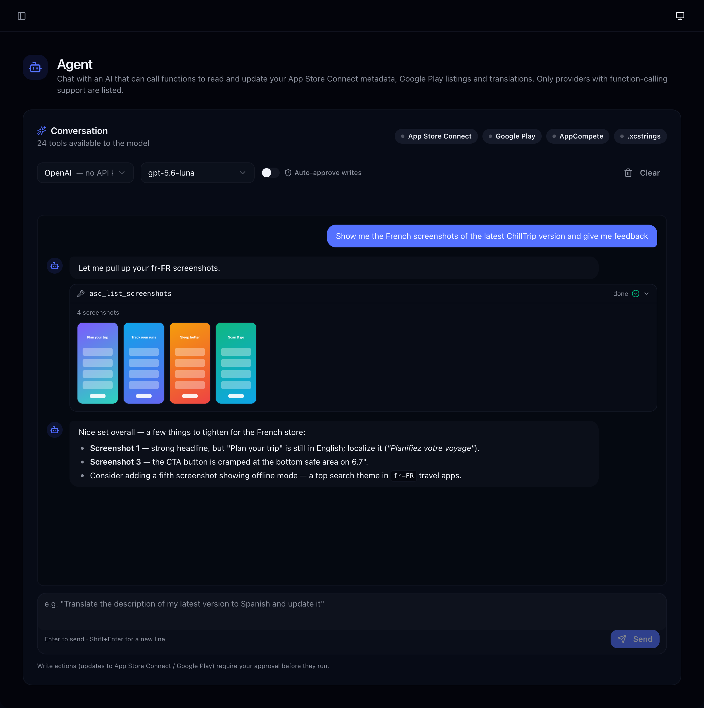

<div align="center">

# 🌍 StoreLocalizer

**Ship your app worldwide — translate, price, and design your store listings with AI.**

[](https://storelocalizer.com/)

[](https://github.com/fayharinn/StoreLocalizer/stargazers)
[](https://www.gnu.org/licenses/agpl-3.0.html)
[](https://github.com/fayharinn/StoreLocalizer/commits/main)
[](https://x.com/fayhecode)

*One tool for the whole store pipeline: `.xcstrings` translation · App Store Connect & Google Play sync ·
ASO keywords · device screenshots · GDP-fair subscription pricing — plus an AI agent that drives it all by chat.*


</div>

---

## Why?

Going global is brutal when you do it by hand:

|  | The manual way | With StoreLocalizer |
|---|---|---|
| 🌍 Localizing 40+ languages | Weeks of copy-paste | **Minutes** — batched AI translation, synced to your stores |
| 💸 Pricing in 175 countries | Guesswork | **GDP-adjusted** recommendations per market |
| 📸 Screenshots per language | A designer's nightmare | **Generated** for every locale from one template |
| 🔑 ASO keywords per locale | Spreadsheets | **Suggested, scored & reviewed** per keyword |

Everything talks **directly** to App Store Connect and Google Play Console — no exports, no copy-paste.

---

## ✨ The toolkit

### 🤖 The Agent — run the whole pipeline by chat

Tell it what you want in plain words and it calls **24 functions** against your real accounts: list apps and versions, audit localizations, translate and push "What's New" to five locales, mine ASO keywords from AppCompete, or find what's missing in your `.xcstrings`. It can even **see your App Store screenshots** — ask for feedback and it reviews each one, with an in-chat gallery to switch locales and a lightbox to zoom in.

<div align="center"></div>

### 🔤 XCStrings Translator

Drop an `.xcstrings` file from Xcode, pick your target languages, translate everything with AI, and export straight back to your project. Format specifiers (`%lld`, `%@`) and protected brand words are preserved, and batched + concurrent requests make 1,000 strings a coffee-break job. Every translation stays one click away from a manual fix:

<div align="center"></div>

### 🔑 ASO keywords that earn their 100 characters

Generate keywords with AI — or plug your **[AppCompete](https://appcompete.com)** account and work with real data: suggestions scored by popularity & difficulty with a live capacity gauge, keywords mined from the competitors you track, and a **per-keyword review** that tells you what to keep, replace, or stop dreaming about:

<table align="center"><tr>
<td></td>
<td></td>
</tr><tr>
<td align="center"><em>Suggestions scored by opportunity, capped at Apple's 100 chars</em></td>
<td align="center"><em>One verdict + one advice per keyword — track the missing ones</em></td>
</tr></table>

### 🏪 App Store Connect & Google Play sync

Connect once with your API keys — then translate descriptions, what's new, keywords and promotional text across every locale, manage screenshots, create versions, and push everything back **without leaving the browser**.

<div align="center"></div>

### 📸 Screenshot Studio

A device-frame screenshot generator that lives next to your translations. Gradient preset galleries, 2D/3D frames (Three.js), AI-generated marketing headlines, one-click caption translation to every project language — then export all locales as a ZIP, sized for any store format.

<table align="center"><tr>
<td width="62%"></td>
<td></td>
</tr><tr>
<td align="center"><em>The studio: projects, languages, style presets, batch export</em></td>
<td align="center"><em>What ships to the store</em></td>
</tr></table>

### 💰 GDP-fair subscription pricing

Set your USA base price and get a recommended price for every storefront based on local purchasing power — then push them to App Store Connect and translate your subscription display names while you're at it.

<div align="center"></div>

---

## 🤖 Bring your own AI

Pick a provider in the sidebar, paste a key, done — keys never leave your browser.

| Provider | Models | Notes |
|---|---|---|
| **OpenAI** | gpt-5.6-luna | model list fetched live from your account |
| **Anthropic (Claude)** | haiku-4.5 · sonnet-4.6 · opus-4.8 | direct browser access |
| **Google (Gemini)** | 3.1-flash-lite · 3.5-flash · 3.1-pro | JSON-native responses |
| **DeepSeek** | v4-flash · v4-pro | |
| **Cloudflare Workers AI** | Llama 3.3/4 · GPT-OSS · Mistral… | 13 open-weight LLMs |
| **AWS Bedrock** | Claude family | bearer-token auth |
| **Azure OpenAI** | your deployments | |
| **GitHub Models** | gpt-4o · gpt-4.1 | free-tier friendly |

*The Agent needs function calling — it works with OpenAI, Anthropic, Gemini, Azure, Bedrock, GitHub Models and DeepSeek.*

---

## 🚀 Quick start

```bash
git clone https://github.com/fayharinn/StoreLocalizer.git
cd StoreLocalizer
bun install        # or npm install
bun run dev        # → http://localhost:5173
```

That's it for local use — the dev server proxies all App Store Connect / Google Play calls for you.

**No install?** Use the hosted version at **[storelocalizer.com](https://storelocalizer.com/)**.

**Desktop app** (Tauri 2, Rust toolchain required):

```bash
bun run tauri:dev      # develop
bun run tauri:build    # package
```

---

## ⚙️ Connect your stores

<details>
<summary><b>App Store Connect API key</b></summary>

1. Go to [App Store Connect → Integrations → API Keys](https://appstoreconnect.apple.com/access/integrations/api)
2. Create a key with **Admin** or **App Manager** role
3. Note your **Key ID** and **Issuer ID**, download the `.p8` file
4. Drop everything in the app sidebar — the `.p8` is encrypted with your password before being stored

</details>

<details>
<summary><b>Google Play service account</b></summary>

1. In [Google Cloud Console](https://console.cloud.google.com/), create a service account with the **Google Play Developer API** enabled and download its JSON key
2. In Play Console → **Users and permissions**, invite the service account email
3. Grant **Admin** or **Release manager** for your app
4. Upload the JSON key in the app sidebar

</details>

<details>
<summary><b>App Store Connect auth flow (how your .p8 stays safe)</b></summary>

```
┌─────────────────────────────────────────────────────────────────────────────┐
│                         App Store Connect Auth Flow                         │
├─────────────────────────────────────────────────────────────────────────────┤
│                                                                             │
│  ┌──────────┐    password     ┌──────────────┐                              │
│  │  .p8 Key │ ──────────────► │  Encrypted   │ ◄─── Stored in localStorage  │
│  │  (file)  │    encrypt      │   .p8 Key    │      (persistent)            │
│  └────┬─────┘                 └──────┬───────┘                              │
│       │                              │                                      │
│       │ sign                         │ password                             │
│       │                              │ decrypt                              │
│       ▼                              ▼                                      │
│  ┌──────────┐                 ┌──────────────┐                              │
│  │   JWT    │ ◄───────────────│  Decrypted   │                              │
│  │  Token   │     sign        │   .p8 Key    │ ◄─── In memory only          │
│  └────┬─────┘                 └──────────────┘      (cleared on reload)     │
│       │                                                                     │
│       │ cache                                                               │
│       ▼                                                                     │
│  ┌──────────────┐                                                           │
│  │ sessionStorage│ ◄─── JWT cached for ~19 min                              │
│  │  (JWT only)   │      Auto-reconnect on page reload                       │
│  └──────┬───────┘                                                           │
│         │                                                                   │
│         │ Bearer token                                                      │
│         ▼                                                                   │
│  ┌──────────────┐                                                           │
│  │  App Store   │                                                           │
│  │ Connect API  │                                                           │
│  └──────────────┘                                                           │
│                                                                             │
└─────────────────────────────────────────────────────────────────────────────┘
```

</details>

**Security model in one paragraph:** your `.p8` key is encrypted in-browser (AES-GCM, PBKDF2 100k iterations) before touching `localStorage`; the decrypted key only ever exists in memory. JWTs are signed client-side with [jose](https://github.com/panva/jose). AI provider keys go straight from your browser to the provider. The only backend is a thin CORS proxy that forwards your `Authorization` header — it stores nothing. It's all open source: audit it.

---

## 🛠️ Production deployment

The web app is static (Vite). Apple & Google block browser CORS, so production needs the bundled Cloudflare Worker as a proxy:

```bash
# 1. Deploy the CORS proxy worker
wrangler deploy -c wrangler.proxy.jsonc

# 2. Point the site at it
echo 'VITE_ASC_PROXY_URL=https://your-worker.workers.dev' >> .env.production
echo 'VITE_GP_PROXY_URL=https://your-worker.workers.dev'  >> .env.production

# 3. Ship the site
bun run deploy:cloudflare   # Cloudflare Pages
bun run deploy              # …or GitHub Pages
```

Remember to add your domain to `ALLOWED_ORIGINS` in [worker/index.js](worker/index.js).

---

## 🧱 Tech stack

**React 19** + **Vite** · **Tailwind** + **shadcn/ui** · **Three.js** (3D device frames) · **jose** (ES256 JWT signing in-browser) · **Tauri 2** (desktop) · **Cloudflare Workers** (CORS proxy)

```text
src/
├── components/        # six pages: agent · xcstrings · appstore · googleplay · screenshots · subscriptions
├── hooks/             # top-level state (useAppState, useTranslation, …)
├── services/          # every external call: ASC, Google Play, 8 AI providers, AppCompete + the agent's tool registry
└── utils/             # xcstrings parser, AES-GCM crypto
```

---

## 🤝 Contributing

Issues and PRs are welcome! Run `bun run lint` before submitting. The screenshots in this README are generated with `node scripts/take-screenshots.mjs` against the dev server (`scripts/take-agent-screenshot.mjs` for the agent shot).

### Contributors

<!-- contributors:start -->
<table>
  <tbody>
    <tr>
      <td align="center">
        <a href="https://github.com/fayharinn">
          <br />
          <sub><b>fayharinn</b></sub>
        </a>
      </td>
      <td align="center">
        <a href="https://github.com/krrskl">
          <br />
          <sub><b>krrskl</b></sub>
        </a>
      </td>
      <td align="center">
        <a href="https://github.com/jtaxiexpress">
          <br />
          <sub><b>jtaxiexpress</b></sub>
        </a>
      </td>
      <td align="center">
        <a href="https://github.com/isnine">
          <br />
          <sub><b>isnine</b></sub>
        </a>
      </td>
      <td align="center">
        <a href="https://github.com/mashegoindustries">
          <br />
          <sub><b>mashegoindustries</b></sub>
        </a>
      </td>
    </tr>
  </tbody>
</table>
<!-- contributors:end -->

*This grid refreshes automatically on every push.*

**Credits:** screenshot generator originally based on [appscreen](https://github.com/YUZU-Hub/appscreen) by Stefan from yuzuhub.com.

## 📄 License

[AGPLv3](LICENSE) — free to use, modify and self-host; derivatives must stay open source.

<div align="center">

Crafted with ❤️ by **[Fayhe](https://github.com/fayharinn)**

⭐ *If this saves you a localization weekend, a star helps others find it.*

</div>
